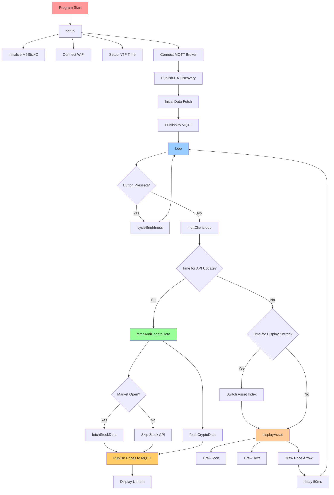

# Crypto & Stock Price Display for M5StickC Plus2

A comprehensive cryptocurrency and stock price ticker that displays real-time prices on the M5StickC Plus2.
Features intelligent market hours detection, price movement indicators, Home Assistant integration via MQTT, and customizable brightness control.


## Features

- **Multi-Asset Display:** BTC, ETH, XRP (CAD) + MSFT Stock (USD)
- **Home Assistant Integration:** Auto-discovery via MQTT with real-time price updates
- **Smart Market Hours:** Stock API only fetches during trading hours (9:05 AM - 4:05 PM ET)
  with automatic EST/EDT switching
- **Price Movement Indicators:** Green up arrows ↗️ and red down arrows ↘️
- **5-Level Brightness Control:** 20%, 40%, 60%, 80%, 100% (Button A to cycle)
- **Efficient API Usage:** 5-minute update intervals to preserve battery and API quotas
- **NTP Time Synchronization:** Automatic Eastern Time (EST/EDT) with DST switching
- **Market Status Display:** Shows "Market Closed" when appropriate while preserving
  last known prices
- **Professional Display:** Centered icons, dynamic positioning, smooth transitions

## Hardware Requirements

- **M5StickC Plus2 ESP32-PICO-V3-02 Mini IoT Development Kit**
  - [Purchase Link][m5stick-purchase]
  - Chip: ESP32-PICO-V3-02 SiP (8MB Flash, 2MB PSRAM)
  - Display: 1.14" TFT LCD

## API & Service Requirements

### CoinMarketCap API (Cryptocurrency Data)

- Create account at [CoinMarketCap API](https://coinmarketcap.com/api/)
- Free tier: 10,000 calls/month (sufficient for this project)

### Financial Modeling Prep API (Stock Data)

- Create account at [Financial Modeling Prep](https://financialmodelingprep.com/)
- Free tier available

### MQTT Broker (Home Assistant Integration)

- **Mosquitto MQTT Broker** running on Home Assistant or standalone
- Can use Home Assistant's built-in Mosquitto add-on
- Default port: 1883

## Installation & Setup

1. **Clone Repository:**

   ```bash
   git clone https://github.com/sfrechette/crypto-price-cad.git
   cd crypto-price-cad
   ```

2. **Configure API Keys & MQTT:**

   ```bash
   cp secrets_template.h src/secrets.h
   # Edit src/secrets.h with your credentials
   ```

   Required configuration in `secrets.h`:
   - WiFi credentials (SSID, password)
   - CoinMarketCap API key
   - Financial Modeling Prep API key
   - MQTT broker IP address (your Home Assistant IP)
   - MQTT credentials (if authentication enabled)

3. **Build & Upload:**

   ```bash
   pio run --target upload
   ```

4. **Home Assistant Setup:**

   The device automatically publishes MQTT discovery configs. After upload:
   - Sensors appear automatically under **Settings → Devices & Services → MQTT**
   - Device name: "Crypto Price Display"
   - Entities created: Bitcoin Price, Ethereum Price, XRP Price, Microsoft Price

## Architecture Overview

### Project Structure

```text
crypto-price-cad/
├── src/
│   ├── main.cpp              # Main application logic & setup
│   ├── api_client.cpp/.h     # Network & API handling
│   ├── crypto_display.cpp/.h # Display management
│   ├── mqtt_client.cpp/.h    # Home Assistant MQTT integration
│   ├── config.h              # Configuration constants
│   ├── secrets.h             # API keys, WiFi & MQTT credentials
│   └── icons.h               # Asset icons & arrows (RGB565)
├── include/                  # Original PNG icons
├── platformio.ini            # PlatformIO configuration
├── SECURITY_SETUP.md         # Credential security guide
└── README.md                 # This file
```

### MQTT Topic Structure

```text
m5crypto/
├── status                    # Device availability (online/offline)
├── btc/state                 # Bitcoin price & trend
├── eth/state                 # Ethereum price & trend
├── xrp/state                 # XRP price & trend
└── msft/state                # Microsoft stock price & trend
```

### Home Assistant Discovery Topics

```text
homeassistant/sensor/m5crypto_btc/config
homeassistant/sensor/m5crypto_eth/config
homeassistant/sensor/m5crypto_xrp/config
homeassistant/sensor/m5crypto_msft/config
```

## Code Execution Flow

### Startup Sequence (setup())

```text
Arduino Framework → main() → setup()
├── 1. Serial.begin(115200)           # Debug output
├── 2. M5.begin()                     # Initialize M5StickC Plus2
├── 3. display.begin()                # Setup display settings
├── 4. Set brightness (20% default)   # M5Unified API brightness control
├── 5. apiClient.connectWiFi()        # Connect to WiFi
├── 6. setupTime()                    # NTP time sync (Eastern Time)
├── 7. mqttClient.begin()             # Connect to MQTT broker
├── 8. publishDiscoveryConfigs()      # Register entities with Home Assistant
├── 9. fetchAndUpdateData()           # Initial data fetch
├── 10. mqttClient.publishPrices()    # Send initial prices to HA
└── 11. Initialize timers             # Setup update intervals
```

### Main Loop (loop()) - Repeats every 50ms

```text
loop() [Continuous Execution]
├── M5.update()                       # Check button presses
├── mqttClient.loop()                 # Maintain MQTT connection
├── Button A pressed?                 # Brightness control
│   └── cycleBrightness()             # Cycle through 5 levels
├── 5 minutes passed?                 # API update check
│   └── fetchAndUpdateData()
│       ├── fetchCryptoData()         # Always fetch crypto (24/7)
│       ├── isMarketOpen()?           # Market hours check
│       │   ├── fetchStockData()      # Fetch if market open
│       │   └── Skip if market closed # Save API calls & battery
│       └── mqttClient.publishPrices()# Send to Home Assistant
├── 10 seconds passed?                # Display rotation
│   └── Switch currentAssetIndex      # BTC→ETH→XRP→MSFT
├── displayAsset()                    # Draw current asset
│   ├── Calculate positioning         # Dynamic centering
│   ├── displayIcon()                 # Draw asset icon
│   ├── Draw asset name & price       # Text rendering
│   └── displayPriceArrow()           # Price movement indicator
└── delay(50ms)                       # CPU throttling
```

### API & MQTT Data Flow

```text
fetchAndUpdateData()
├── Crypto API Flow (24/7):
│   ├── HTTPSClient → api.coinmarketcap.com
│   ├── JSON Response → parseCryptoJsonResponse()
│   └── Update BTC, ETH, XRP prices
├── Stock API Flow (Market Hours Only):
│   ├── isMarketOpen() → Check Eastern Time & weekday
│   ├── HTTPSClient → financialmodelingprep.com
│   ├── JSON Response → parseStockJsonResponse()
│   └── Update MSFT price with timestamp
└── MQTT Publishing:
    ├── mqttClient.publishPrices()
    ├── Build JSON payload (price, trend, updated)
    └── Publish to m5crypto/{symbol}/state
```

### MQTT Message Flow

```text
Device Startup:
├── Connect to MQTT Broker
├── Set Last Will: m5crypto/status → "offline"
├── Publish: m5crypto/status → "online"
└── Publish Discovery Configs (4 sensors)

Every 5 Minutes:
├── Fetch prices from APIs
├── For each asset:
│   └── Publish JSON to m5crypto/{symbol}/state
│       {"price": 63245.67, "trend": "up", "updated": "14:30:45"}
└── Home Assistant auto-updates entities

On Disconnect:
└── Broker publishes Last Will: m5crypto/status → "offline"
```

### Display Rendering Flow

```text
displayAsset(asset)
├── Calculate Layout:
│   ├── Icon position (centered with text)
│   ├── Text width measurement
│   └── Price + arrow positioning
├── Render Components:
│   ├── Asset icon (24x24 RGB565)
│   ├── Asset name (white text)
│   ├── Price value (yellow text)
│   └── Movement arrow (green↗️/red↘️)
└── Optimize Updates:
    ├── Only redraw changed elements
    └── Prevent screen flashing
```

## Visual Flow Diagram



*Copy the above Mermaid code to [mermaid.live](https://mermaid.live) for an interactive diagram*

## Home Assistant Integration

### Auto-Discovered Entities

After device startup, the following sensors are created automatically:

| Entity ID | Name | Unit | Icon |
|-----------|------|------|------|
| `sensor.m5crypto_btc_price` | Bitcoin Price | CAD | mdi:bitcoin |
| `sensor.m5crypto_eth_price` | Ethereum Price | CAD | mdi:ethereum |
| `sensor.m5crypto_xrp_price` | XRP Price | CAD | mdi:alpha-x-circle |
| `sensor.m5crypto_msft_price` | Microsoft Price | USD | mdi:microsoft |

### Sensor Attributes

Each sensor includes additional attributes:

- **trend**: "up", "down", or "unknown"
- **updated**: Last update timestamp

### Example Dashboard Card

```yaml
type: entities
title: Crypto Prices
entities:
  - entity: sensor.m5crypto_btc_price
    name: Bitcoin
  - entity: sensor.m5crypto_eth_price
    name: Ethereum
  - entity: sensor.m5crypto_xrp_price
    name: XRP
  - entity: sensor.m5crypto_msft_price
    name: Microsoft
```

### Example Automation

```yaml
automation:
  - alias: "Notify on Bitcoin Price Change"
    trigger:
      - platform: state
        entity_id: sensor.m5crypto_btc_price
    condition:
      - condition: template
        value_template: "{{ trigger.to_state.attributes.trend == 'up' }}"
    action:
      - service: notify.mobile_app
        data:
          title: "Bitcoin Going Up! 📈"
          message: "BTC is now ${{ states('sensor.m5crypto_btc_price') }} CAD"
```

### XRP Icon Note

The XRP sensor uses `mdi:alpha-x-circle` since Material Design Icons don't include a native XRP logo. For the actual XRP logo, install [Simple Icons](https://github.com/vigonotion/hass-simpleicons) via HACS and change the icon to `si:xrp` in the entity settings.

## Key Function Groups

### API & Network Functions

- `APIClient::connectWiFi()` - WiFi connection with timeout
- `APIClient::fetchCryptoData()` - CoinMarketCap API calls
- `APIClient::fetchStockData()` - Financial Modeling Prep API calls
- `APIClient::parseJsonResponse()` - JSON data parsing
- `isMarketOpen()` - Eastern Time market hours detection with EST/EDT auto-switching

### Display Functions

- `CryptoDisplay::displayAsset()` - Main rendering function
- `CryptoDisplay::displayIcon()` - Asset icon rendering
- `CryptoDisplay::displayPriceArrow()` - Price movement indicators
- `CryptoDisplay::formatPrice()` - Price formatting with commas

### MQTT Functions

- `MQTTClient::begin()` - Connect to MQTT broker with LWT
- `MQTTClient::publishDiscoveryConfigs()` - Register entities with Home Assistant
- `MQTTClient::publishPrices()` - Send current prices to all topics
- `MQTTClient::publishAvailability()` - Device online/offline status
- `MQTTClient::loop()` - Maintain connection (call in main loop)

### Utility Functions

- `setupTime()` - NTP synchronization
- `cycleBrightness()` - Brightness control
- `fetchAndUpdateData()` - Main update coordinator

## Latest Features & Improvements

### **Home Assistant Integration (v2.2)**

- **MQTT Auto-Discovery:** Entities automatically appear in Home Assistant
- **Real-Time Updates:** Prices published every 5 minutes via MQTT
- **Device Grouping:** All sensors grouped under "Crypto Price Display" device
- **Availability Tracking:** Online/offline status with Last Will and Testament
- **Trend Attributes:** Price direction (up/down) available for automations

### **Performance Optimizations (v2.1)**

- **50% Faster Button Response:** Loop delay reduced from 100ms to 50ms
- **2 Seconds Faster Startup:** WiFi network scan disabled by default
- **Memory Optimization:** Constants moved to flash memory
- **M5Unified Library:** Universal M5Stack library for better device compatibility
- **Cleaner Code:** Price tracking centralized in API client layer

### **Eastern Time Zone Support (v2.1)**

- **Automatic EST/EDT Switching:** Proper US Eastern Time handling
- **No More Midnight API Calls:** Fixed timezone bug
- **Accurate Market Hours:** 9:05 AM - 4:05 PM ET with DST adjustments

### **Smart Market Status Display (v2.1)**

- **"Market Closed" Message:** Clear status when stock market is closed
- **Price Persistence:** Last known stock price remains visible
- **Arrow Preservation:** Price movement indicators persist through market close

## Performance Optimizations

### Battery Life

- **5-minute API intervals** instead of continuous fetching
- **Market hours detection** prevents unnecessary stock API calls
- **Partial screen updates** to minimize display power consumption
- **50ms loop delay** balances CPU usage with responsive button control

### API Efficiency

- **Smart caching** - displays last known prices during API failures
- **Rate limit compliance** - stays within free tier quotas
- **Error handling** - graceful degradation on network issues

### Memory Management

- **PROGMEM storage** for icons (saves RAM)
- **StaticJsonDocument** for MQTT payloads (stack-based, efficient)
- **Efficient string handling** to prevent memory fragmentation
- **Constexpr constants** stored in flash memory instead of RAM

### Network Efficiency

- **MQTT Keep-Alive** maintains persistent broker connection
- **Retained Messages** for discovery configs (survive broker restart)
- **Last Will and Testament** for reliable offline detection

## Configuration Options

### Update Intervals (config.h)

```cpp
#define API_UPDATE_INTERVAL 300000    // 5 minutes
#define DISPLAY_DURATION 10000        // 10 seconds per asset
```

### Brightness Levels (main.cpp)

```cpp
constexpr uint8_t BRIGHTNESS_LEVELS[] = {51, 102, 153, 204, 255}; // 5 levels: 20-100%
uint8_t currentBrightnessIndex = 0;                                 // Default: 20%
```

### Market Hours (main.cpp)

```cpp
int marketOpenMinutes = 9 * 60 + 5;   // 9:05 AM ET
int marketCloseMinutes = 16 * 60 + 5;  // 4:05 PM ET
```

### MQTT Settings (secrets.h)

```cpp
#define MQTT_BROKER "192.168.1.100"   // Home Assistant IP
#define MQTT_PORT 1883                 // Default Mosquitto port
#define MQTT_USER "mqtt_user"          // Optional authentication
#define MQTT_PASSWORD "mqtt_pass"      // Optional authentication
#define MQTT_CLIENT_ID "m5crypto"      // Unique client ID
#define MQTT_TOPIC_PREFIX "m5crypto"   // Base topic for messages
```

## Development Tools

### Code Analysis Tools

- **Doxygen + Graphviz** - Generate call graphs from comments
- **VS Code + C/C++ Extension** - Call hierarchy viewer
- **Mermaid.js** - Flowchart visualization
- **PlatformIO** - Build system and debugging

### Debugging

```bash
# Serial monitor
pio device monitor --baud 115200

# Build with debug info
pio run -e debug

# Upload and monitor
pio run --target upload && pio device monitor
```

### MQTT Debugging

```bash
# Monitor all m5crypto topics
mosquitto_sub -h YOUR_HA_IP -u USER -P PASS -t "m5crypto/#" -v

# Monitor Home Assistant discovery
mosquitto_sub -h YOUR_HA_IP -u USER -P PASS -t "homeassistant/sensor/m5crypto_#/config" -v
```

## Monitoring & Logs

### Serial Output Examples

**Startup with MQTT:**

```text
=== Cryptocurrency Price Display v2.2 (M5StickC Plus2) ===
Initial brightness set to: 51/255 (20%)
WiFi connected to: YourNetwork
Time synchronized: 2024-09-25 14:30:45 ET
MQTT: Connecting to broker 192.168.1.100:1883
MQTT: Connected successfully!
MQTT: Published availability: online
MQTT: Publishing Home Assistant discovery configs...
MQTT: Discovery BTC -> OK
MQTT: Discovery ETH -> OK
MQTT: Discovery XRP -> OK
MQTT: Discovery MSFT -> OK
```

**During Market Hours:**

```text
Current time: 14:30 ET, Market OPEN
Successfully fetched crypto data:
  BTC: $63,245.67 CAD (UP)
  ETH: $3,456.78 CAD (DOWN)
  XRP: $0.89 CAD (UP)
Successfully fetched stock data (market open): MSFT: $425.67 USD (UP)
MQTT: Publishing price updates...
MQTT: BTC $63245.67 CAD -> OK
MQTT: ETH $3456.78 CAD -> OK
MQTT: XRP $0.89 CAD -> OK
MQTT: MSFT $425.67 USD -> OK
```

**After Market Close:**

```text
Current time: 16:06 ET, Market CLOSED
Market closed - displaying last known price: MSFT: $425.67 USD
```

## Troubleshooting

### Common Issues

1. **WiFi Connection Failed** - Check credentials in `secrets.h`
2. **API Errors** - Verify API keys and quotas
3. **Time Sync Issues** - Check NTP server accessibility
4. **Display Issues** - Verify M5StickC Plus2 connection
5. **MQTT Connection Failed** - Check broker IP, port, and credentials
6. **Entities Not Appearing in HA** - Verify MQTT integration is configured
7. **Stock API Fetching at Wrong Times** - Ensure timezone shows "ET" in logs
8. **MSFT Showing Blank/Zero** - Normal when "Market Closed" message appears

### MQTT Troubleshooting

1. **Verify broker is running:**
   ```bash
   systemctl status mosquitto
   ```

2. **Test connection manually:**
   ```bash
   mosquitto_pub -h YOUR_HA_IP -u USER -P PASS -t "test" -m "hello"
   ```

3. **Check HA MQTT integration:** Settings → Devices & Services → MQTT

4. **Common MQTT errors:**
   - `MQTT_CONNECT_BAD_CREDENTIALS` - Wrong username/password
   - `MQTT_CONNECTION_TIMEOUT` - Wrong IP or firewall blocking
   - `MQTT_CONNECT_UNAUTHORIZED` - User not authorized

### Debug Steps

1. Enable serial monitor for detailed logs
2. Check WiFi signal strength
3. Verify API responses in serial output
4. Monitor MQTT topics with mosquitto_sub
5. Check Home Assistant logs for MQTT errors

## License

This project is open source. See the [LICENSE](LICENSE) file for details.

## Contributing

1. Fork the repository
2. Create a feature branch
3. Make your changes
4. Add tests if applicable
5. Submit a pull request

## Support

- **Hardware Issues**: [M5Stack Community](https://community.m5stack.com/)
- **API Issues**: Check respective API documentation
- **MQTT Issues**: [Mosquitto Documentation](https://mosquitto.org/documentation/)
- **Home Assistant**: [HA Community](https://community.home-assistant.io/)
- **Code Issues**: Create an issue in this repository

---

<!-- Reference Links -->
[m5stick-purchase]: https://shop.m5stack.com/products/m5stickc-plus2-esp32-mini-iot-development-kit
