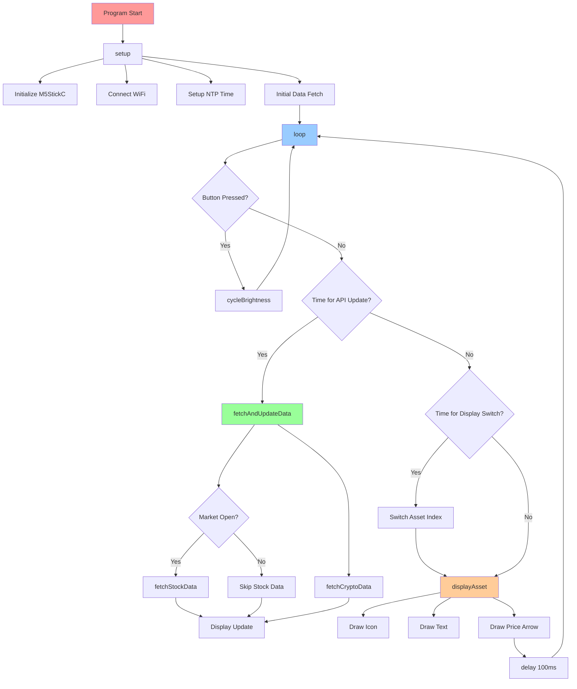

# Crypto & Stock Price Display for M5StickC Plus

A comprehensive cryptocurrency and stock price ticker that displays real-time prices on the M5StickC Plus.
Features intelligent market hours detection, price movement indicators, and customizable brightness control.


## Features

- **Multi-Asset Display:** BTC, ETH, XRP (CAD) + MSFT Stock (USD)
- **Smart Market Hours:** Stock API only fetches during trading hours (9:05 AM - 4:05 PM ET)
  with automatic EST/EDT switching
- **Price Movement Indicators:** Green up arrows ↗️ and red down arrows ↘️
- **5-Level Brightness Control:** 20%, 40%, 60%, 80%, 100% (Button A to cycle)
- **Efficient API Usage:** 5-minute update intervals to preserve battery and API quotas
- **NTP Time Synchronization:** Automatic Eastern Time (EST/EDT) with DST switching
- **Market Status Display:** Shows "Market Closed" when appropriate while preserving
  last known prices
- **Professional Display:** Centered icons, dynamic positioning, smooth transitions

## Hardware Requirements

- **M5StickC Plus ESP32-PICO Mini IoT Development Kit**
  - [Purchase Link][m5stick-purchase]
  - [GitHub Repository](https://github.com/m5stack/M5StickC-Plus)

## API Requirements

### CoinMarketCap API (Cryptocurrency Data)

- Create account at [CoinMarketCap API](https://coinmarketcap.com/api/)
- Free tier: 10,000 calls/month (sufficient for this project)

### Financial Modeling Prep API (Stock Data)

- Create account at [Financial Modeling Prep](https://financialmodelingprep.com/)
- Free tier available

## Installation & Setup

1. **Clone Repository:**

   ```bash
   git clone https://github.com/sfrechette/crypto-price-cad.git
   cd crypto-price-cad
   ```

2. **Configure API Keys:**

   ```bash
   cp secrets_template.h src/secrets.h
   # Edit src/secrets.h with your credentials
   ```

3. **Build & Upload:**

   ```bash
   pio run --target upload
   ```

## Architecture Overview

### Project Structure

```
crypto-price-cad/
├── src/
│   ├── main.cpp              # Main application logic & setup
│   ├── api_client.cpp/.h     # Network & API handling
│   ├── crypto_display.cpp/.h # Display management
│   ├── config.h              # Configuration constants
│   ├── secrets.h             # API keys & WiFi credentials
│   └── icons.h               # Asset icons & arrows (RGB565)
├── include/                  # Original PNG icons
├── platformio.ini            # PlatformIO configuration
└── README.md                 # This file
```

## Code Execution Flow

### Startup Sequence (setup())

```
Arduino Framework → main() → setup()
├── 1. Serial.begin(115200)           # Debug output
├── 2. M5.begin()                     # Initialize M5StickC Plus
├── 3. display.begin()                # Setup display settings
├── 4. Set brightness (60% default)   # AXP192 brightness control
├── 5. apiClient.scanNetworks()       # WiFi network scan
├── 6. apiClient.connectWiFi()        # Connect to WiFi
├── 7. setupTime()                    # NTP time sync (Eastern Time)
├── 8. fetchAndUpdateData()           # Initial data fetch
└── 9. Initialize timers              # Setup update intervals
```

### Main Loop (loop()) - Repeats every 100ms

```
loop() [Continuous Execution]
├── M5.update()                       # Check button presses
├── Button A pressed?                 # Brightness control
│   └── cycleBrightness()             # Cycle through 5 levels
├── 5 minutes passed?                 # API update check
│   └── fetchAndUpdateData()
│       ├── fetchCryptoData()         # Always fetch crypto (24/7)
│       └── isMarketOpen()?           # Market hours check
│           ├── fetchStockData()      # Fetch if market open
│           └── Skip if market closed # Save API calls & battery
├── 3 seconds passed?                 # Display rotation
│   └── Switch currentAssetIndex      # BTC→ETH→XRP→MSFT
├── displayAsset()                    # Draw current asset
│   ├── Calculate positioning         # Dynamic centering
│   ├── displayIcon()                 # Draw asset icon
│   ├── Draw asset name & price       # Text rendering
│   └── displayPriceArrow()           # Price movement indicator
└── delay(100ms)                      # CPU throttling
```

### API Data Flow

```
fetchAndUpdateData()
├── Crypto API Flow (24/7):
│   ├── HTTPSClient → api.coinmarketcap.com
│   ├── JSON Response → parseCryptoJsonResponse()
│   └── Update BTC, ETH, XRP prices
└── Stock API Flow (Market Hours Only):
    ├── isMarketOpen() → Check Eastern Time & weekday (EST/EDT auto)
    ├── HTTPSClient → financialmodelingprep.com (if market open)
    ├── JSON Response → parseStockJsonResponse() (if market open)
    ├── Update MSFT price with timestamp conversion (if market open)
    └── Set "Market Closed" status & preserve last price (if closed)
```

### Display Rendering Flow

```
displayAsset(asset)
├── Calculate Layout:
│   ├── Icon position (centered with text)
│   ├── Text width measurement
│   └── Price + arrow positioning
├── Render Components:
│   ├── Asset icon (24x24 RGB565)
│   ├── Asset name (white text)
│   ├── Price value (yellow text)
│   └── Movement arrow (green↗️/red↘️)
└── Optimize Updates:
    ├── Only redraw changed elements
    └── Prevent screen flashing
```

## Visual Flow Diagram



*Copy the above Mermaid code to [mermaid.live](https://mermaid.live) for an interactive diagram*

## Key Function Groups

### API & Network Functions

- `APIClient::connectWiFi()` - WiFi connection with timeout
- `APIClient::fetchCryptoData()` - CoinMarketCap API calls
- `APIClient::fetchStockData()` - Financial Modeling Prep API calls
- `APIClient::parseJsonResponse()` - JSON data parsing
- `isMarketOpen()` - Eastern Time market hours detection with EST/EDT auto-switching

### Display Functions

- `CryptoDisplay::displayAsset()` - Main rendering function
- `CryptoDisplay::displayIcon()` - Asset icon rendering
- `CryptoDisplay::displayPriceArrow()` - Price movement indicators
- `CryptoDisplay::formatPrice()` - Price formatting with commas

### Utility Functions

- `setupTime()` - NTP synchronization
- `cycleBrightness()` - Brightness control
- `fetchAndUpdateData()` - Main update coordinator

## Latest Features & Improvements

### **Eastern Time Zone Support (v2.1)**

- **Automatic EST/EDT Switching:** Uses `configTime(-5 * 3600, 3600, ...)` for proper US Eastern Time
- **No More Midnight API Calls:** Fixed timezone bug that caused stock fetching at 11:30 PM
- **Accurate Market Hours:** 9:05 AM - 4:05 PM ET with automatic daylight saving adjustments

### **Smart Market Status Display (v2.1)**

- **"Market Closed" Message:** Shows clear status when stock market is closed
- **Price Persistence:** Last known stock price remains visible until next trading day
- **Arrow Preservation:** Price movement indicators persist through market close
- **Intelligent Initialization:** Shows "Market Closed" instead of blank display on startup

### **Enhanced User Experience**

- **Professional Status Messages:** Clear communication of market state
- **Data Continuity:** No loss of price information during market closure
- **Battery Optimization:** Zero unnecessary API calls during off-hours
- **Timezone Accuracy:** Proper Eastern Time handling for all market operations

## Performance Optimizations

### Battery Life

- **5-minute API intervals** instead of continuous fetching
- **Market hours detection** prevents unnecessary stock API calls
- **Partial screen updates** to minimize display power consumption
- **100ms loop delay** to reduce CPU usage

### API Efficiency

- **Smart caching** - displays last known prices during API failures
- **Rate limit compliance** - stays within free tier quotas
- **Error handling** - graceful degradation on network issues

### Memory Management

- **PROGMEM storage** for icons (saves RAM)
- **Static buffers** for timestamp conversion
- **Efficient string handling** to prevent memory fragmentation

## Configuration Options

### Update Intervals (config.h)

```cpp
#define API_UPDATE_INTERVAL (5 * 60 * 1000)    // 5 minutes
#define DISPLAY_DURATION (3 * 1000)            // 3 seconds per asset
```

### Brightness Levels (main.cpp)

```cpp
int brightnessLevels[] = {20, 40, 60, 80, 100}; // 5 levels
int currentBrightnessIndex = 2;                  // Default: 60%
```

### Market Hours (main.cpp)

```cpp
int marketOpenMinutes = 9 * 60 + 5;   // 9:05 AM ET
int marketCloseMinutes = 16 * 60 + 5;  // 4:05 PM ET
// Timezone: EST/EDT auto-switching via configTime(-5 * 3600, 3600, ...)
```

## Development Tools

### Code Analysis Tools

- **Doxygen + Graphviz** - Generate call graphs from comments
- **VS Code + C/C++ Extension** - Call hierarchy viewer
- **Mermaid.js** - Flowchart visualization
- **PlatformIO** - Build system and debugging

### Debugging

```bash
# Serial monitor
pio device monitor --baud 115200

# Build with debug info
pio run -e debug

# Upload and monitor
pio run --target upload && pio device monitor
```

## Monitoring & Logs

### Serial Output Examples

**During Market Hours:**

```
=== Cryptocurrency Price Display v2.0 ===
WiFi connected to: YourNetwork
Time synchronized: 2024-09-25 14:30:45 ET
Current time: 14:30 ET, Market OPEN
Successfully fetched crypto data:
  BTC: $63,245.67 CAD (UP)
  ETH: $3,456.78 CAD (DOWN)
  XRP: $0.89 CAD (UP)
Successfully fetched stock data: MSFT: $425.67 USD (UP)
Brightness changed to: 80/100 (level 4)
```

**After Market Close:**

```
Current time: 16:06 ET, Market CLOSED
Market closed - displaying last known price: MSFT: $425.67 USD
```

**Weekend/Before First Fetch:**

```
Current time: 10:30 ET, Market CLOSED
Market closed - no price data available yet
```

## Troubleshooting

### Common Issues

1. **WiFi Connection Failed** - Check credentials in `secrets.h`
2. **API Errors** - Verify API keys and quotas
3. **Time Sync Issues** - Check NTP server accessibility
4. **Display Issues** - Verify M5StickC Plus connection
5. **Stock API Fetching at Wrong Times** - Ensure timezone is properly configured (should see "ET" in logs, not "EDT")
6. **MSFT Showing Blank/Zero** - Check if "Market Closed" message appears; this is normal behavior
7. **Price Arrows Wrong Color** - Up arrows should be green, down arrows red; display may interpret colors differently

### Debug Steps

1. Enable serial monitor for detailed logs
2. Check WiFi signal strength
3. Verify API responses in serial output
4. Test with minimal configuration

## License

This project is open source. See the LICENSE file for details.

## Contributing

1. Fork the repository
2. Create a feature branch
3. Make your changes
4. Add tests if applicable
5. Submit a pull request

## Support

- **Hardware Issues**: [M5Stack Community](https://community.m5stack.com/)
- **API Issues**: Check respective API documentation
- **Code Issues**: Create an issue in this repository

---

**Built with ❤️ for the maker community**

<!-- Reference Links -->
[m5stick-purchase]: https://shop.m5stack.com/products/m5stickc-plus-esp32-pico-mini-iot-development-kit
